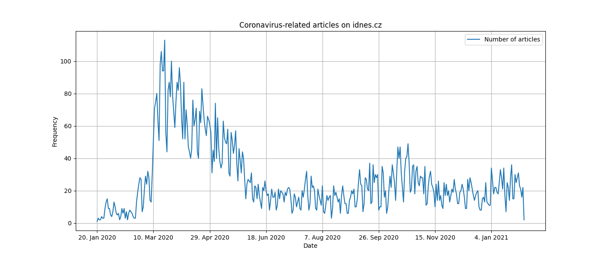

# Frequency of coronavirus-related articles on iDNES.cz

Despite the [controversies](https://en.wikipedia.org/wiki/Mafra_(company)) surrounding the website, iDNES.cz is one of the most popular online-news sources in the Czech Republic with roughly [3 000 000 site visits per day](https://rating.gemius.com/cz/tree/2) . 

I was interested to see how many coronavirus-related articles was this online media outlet able to produce each day. Thankfully, they seem to tag/group articles by topic, and thus, it is possible to list only those articles that were deemed to be related to COVID-19. Even more amazingly, the pages are easily scrapable and there is a pattern in the URLs:

```
https://www.idnes.cz/zpravy/zahranicni/koronavirus.K466979/2
https://www.idnes.cz/zpravy/zahranicni/koronavirus.K466979/3
https://www.idnes.cz/zpravy/zahranicni/koronavirus.K466979/4
...
```

Borrowing from the [towardsdatascience.com article on web scraping](https://towardsdatascience.com/web-scraping-using-python-4cb2faade338), I wrote a program that scraped the date off each coronavirus-related article from January 2020 to the beginning of February 2021. 

The idea is quite simple: by focusing on a specific `div` tag, the program saves the publication date of each article (which, again, is almost always in a nice `DD.MMMM.YYYY` format) to a list. Naturally, the list will be full of duplicate dates, which is exactly what is needed. By counting the frequency of each date using the `Counter` function and subsequently plotting the data frame, the following image is returned:



Indeed, we may observe a large increase in the number of articles related to COVID-19 in the early days of the pandemic. Interestingly, the first COVID-19 cases in the Czech Republic were announced on March 1st 2020; however, we see that the boom started roughly a week later.

Feel free to explore the dataset yourself, it can be found in the repository under the name `covid_articles_data.csv`.

